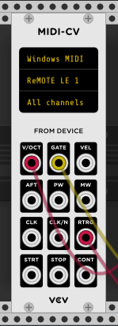

# Quick Start

Once Rack is installed and launched *(see [Installing](Installing.html))*, you will see the default template project.

This patch is designed to familerise yourself with how VCV Rack works. The modules in this patch are from VCV Fundamental plugins, from left to right they are:

**Midi CV:** Takes input from the user and converts it into voltages which VCV Rack understands.

**VCO-1:** Voltage Controled Oscillator with individual Sine, Triangle, Saw and Square waveform ouputs. The Frequency knob sets the pitch of the oscillator.

**VCF:** Voltage Contolled Filter, applies a filtering effect to the sound output which in this case is coming from the Saw output on VCO-1.

**ADSR:** Attack Decay Sustain Release, Converts note on/off or triggered intput into time based envelope signal which can shape how the volume of the sound is preceived by the ear. Each stage on the envelope can be set by a knob or by modulation from another source.

**Scope:** Displays voltages of any cable connected to it, in this patch the Saw waveform will display (channel output 1) from the mixer is connected (Yellow Cable). The time or zoom of the waveform can be set with the Time knob.

**Mixer:** Mixes different signals together the sliders set the volume of the connected signal. In the default patch the output is coming from the Voltage Controlled Filter(VCF) via VCO-1 Saw output. There is also modulation coming from the ADSR envelope, when a note on/off message is recieved from Midi-CV the volume will go up/down respective to the envelope shape being generated by ADSR.

**Audio-8:** Sends digital information, generated by plugins in your Rack, to your audio device / interface which is then converted into anolog information to be heard.

Adding additional modules can be done by right-clicking on an empty space on the rack or by pressing `<enter>`.

When you have more plugins added via your VCV account they will display here once the module browser is opened. Filtering for specific modules can be done by searching or by clicking on indivdual tags.

You can move modules around by clicking and dragging an empty space on its panel. Additionally you can make room for another module in between two or more modules by pressing CTRL / CMD and clicking an empty space on the panel you want to move.

# Getting sound

The sound from VCO-1 or any oscillator is constantly playing in the background. In the default patch it is set up in such a way that you only hear sound when you want to. To get sound first select an audio device on the Audio-8 module, in my case it will be ASIO and my interface's device driver.

The patch is already set up to take input from the keyboard and convert it into MIDI messages which are interpreted by the VCO-1 v/oct input. Once your sound driver is selected on Audio-8 pressing certain keys on your keyboard will simultaneously send a Gate signal to ADSR telling it to start and send the midi note information to VCO-1 telling it what key to play. Refer to this image to see which keys on the keyboard produce which notes. 

If you have a midi keyboard installed on your system this can be selected in the list of devices from Midi-CV.

---
Continue adding more modules, such as LFO-1 and Mixer from the Fundamental plugin.
Connect a cable from the SIN output of the VCO-1 to the input of the Mixer by clicking and dragging from one of the ports.

Connect another cable from the Mixer output to the first channel of Audio's "output" section, and add another cable to the second channel.
You can stack multiple cables on output ports by dragging from an input to an output, or by Ctrl-clicking (Cmd-clicking on MacOS) from an output to an input.

Finally, adjust Mixer's first channel or main volume by clicking and dragging the fader or knob upward/downward.

At this point, you are ready to learn the rest of the Fundamental modules to build your own unique patches.
I personally recommend that you attempt to push the Fundamental modules to their limits before moving on to other official or third-party plugins.
They are more capable than they might appear, and learning how to use them effectively will give you more power and understanding when installing more modules later.
When you are ready, install more plugins with the [Plugin Manager](https://vcvrack.com/plugins.html).
